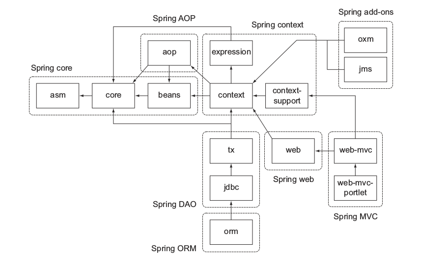

##项目模块化

在企业项目中，包层次和类关系比较负责，把代码拆分成模块是一个比较困难的任务，因为这需要你清晰的划分功能的边界，比如把业务逻辑和数据持久化拆分开来。

###解耦和聚合

但你的项目符合高内聚低耦合时，模块化就变得很容易，这是一条非常好的软件开发实践。一个很好的模块化的例子就是Spring框架，spring框架提供了很多服务，比如MVC web框架、事务管理器、JDBC数据库连接等，下图展示了Spring3.x的模块间的关系：

看起来这个架构非常的庞大吓人，定义了非常多的组件相互间的依赖关系比较复杂，在实际使用过程中你并不需要导入整个框架到你的项目中，你可以选择你需要使用的服务。幸运的是模块之间的依赖都是通过元数据指定的，Gradle的依赖管理很容易解析它的传递依赖。

###区分模块

下面我们还是继续之前那个ToDo的例子，我们来把它拆分为多个模块。

你已经根据类的功能把它们拆分成一个个包，基本上分为下面几个功能：

* 模型: 用来表示数据
* 仓库: 检索和存储数据
* Web: 用来处理HTTP请求、渲染页面的Web组件

虽然这是一个非常小的项目，这些模块之间也有依赖关系：

###重构成模块

现在很容易把存在的项目结构重构成几个模块，对于每个模块，使用合适的名称创建一个子目录，把相关的代码移动到里面。默认的源代码路径src/main/java还是毫发无损，Web模块需要默认的web应用源代码目录src/main/webapp,下面显示了模块化的项目布局：

